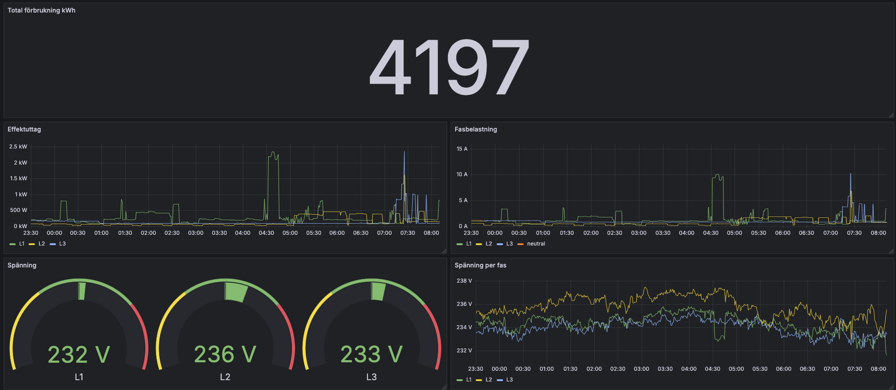

# P1 Port Prometheus Exporter

This project provides a Prometheus exporter for energy meters with a P1 port, parsing OBIS codes and exposing metrics for monitoring purposes.



## What is a P1 Port?


The **P1 port** is a standardized communication interface found on smart energy meters, particularly in Europe. It allows real-time access to detailed energy usage and production data. The port outputs data in a readable format, enabling integration with home automation systems and monitoring tools.

## What is OBIS?

**OBIS** (Object Identification System) codes are a standardized system for identifying measured quantities in energy meters. Each OBIS code corresponds to a specific data point, such as active energy import or reactive power export. This standardization ensures consistent data interpretation across different devices and platforms.

## Test Data

The project includes test data located in 

data.txt

, which contains sample P1 port output with OBIS codes. This data is useful for testing and development without needing a physical energy meter.

## Prometheus Exporter

The Prometheus exporter is implemented in 

metrics.go

. It reads data from the P1 port, parses the OBIS codes, and exposes the metrics in a format compatible with Prometheus. This allows for efficient monitoring and visualization of energy consumption and production using Prometheus and Grafana.

## How to Build and Run

### Prerequisites

- Go 1.16 or higher
- Make utility
- Access to a P1 port (or use the provided test data)
- Raspberry Pi Zero W2 or macOS system

### Building the Project

Clone the repository and navigate to the project directory:

```sh
git clone <repository-url>
cd <project-directory>
```

Build the project using the provided 

Makefile

:

```sh
make build
```

This command compiles the code and produces the executables:

- 

elcentral_rpi

 for Raspberry Pi
- 

elcentral_mac

 for macOS

### Running the Exporter

#### On Raspberry Pi

Ensure that the P1 port is connected to the Raspberry Pi. Run the exporter with:

```sh
./elcentral_rpi
```

#### On macOS

To test the exporter using the provided test data, execute:

```sh
./elcentral_mac -debug
```

## System Requirements

- **Raspberry Pi Zero W2** or equivalent device for running the exporter in a production environment.
- **macOS system** for development, testing, or if a Raspberry Pi is not available.

## Additional Information

- The exporter parses OBIS codes defined in the OBIS standard documentation and maps them to Prometheus metrics.
- Metric definitions and parsing logic are implemented in 

metrics.go

.
- The main application entry point is in 

main.go

.

## Troubleshooting

- Ensure that the serial port path is correctly specified when running the exporter.
- Use the `-debug` flag to enable debug logging for more detailed output:

  ```sh
  ./elcentral_rpi -debug
  ```

- Verify that all dependencies are installed and up to date.

## Contributing

Contributions are welcome. Please submit a pull request or open an issue for any bugs or feature requests.

## License

This project is open-source and available under the MIT License.


git remote add origin git@github.com:fiddeb/p1_prometheus.git